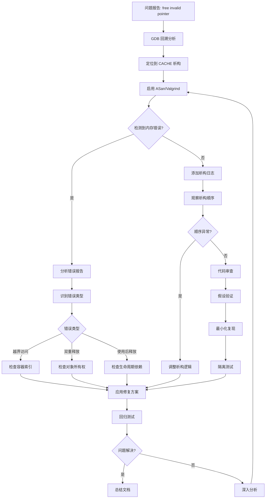

# 内存释放异常调试设计

## 问题概述

程序在执行结束阶段抛出 `free(): invalid pointer` 异常并触发核心转储，从 GDB 回溯信息可见错误发生在 CACHE 析构函数中。

### 异常信息

```
free(): invalid pointer
已放弃 (核心已转储)

Program received signal SIGABRT, Aborted.
```

### 调用栈分析

```
#0  pthread_kill_implementation
#1  raise
#2  abort
#3  __libc_message.cold
#4  malloc_printerr
#5  _int_free
#6  free
#7  CACHE::~CACHE()
#8  generated_environment::~generated_environment()
#9  main
```

## 问题定位

### 根因分析

从调用栈和代码结构分析，问题发生在程序终止时对象销毁阶段，具体在 CACHE 析构函数执行时触发。可能的原因包括：

**内存管理问题**
- 双重释放：同一块内存被释放多次
- 野指针释放：释放了未分配或已释放的指针
- 堆损坏：内存越界写入导致堆结构破坏

### 关键观察

**CACHE 对象结构**
- 包含 `std::unique_ptr<prefetcher_module_concept>` 类型的 `pref_module_pimpl`
- 包含 `std::unique_ptr<replacement_module_concept>` 类型的 `repl_module_pimpl`
- 使用移动构造和移动赋值，涉及资源所有权转移

**Kairos 预取器特征**
- 持有 `CACHE*` 类型的裸指针 `llc_cache`
- 包含复杂数据结构：`DetectUnit`、`TrainUnit`、`MetaDataTable`
- `MetaDataTable` 中包含 `vector<LFUCache<MetaEntry>>` 动态分配的容器

**潜在问题点**

1. **对象生命周期依赖**
   - kairos 预取器通过 `llc_cache` 指针持有对 CACHE 对象的引用
   - 在 CACHE 析构时，预取器模块可能尝试访问已失效的 CACHE 资源

2. **vector 动态扩容与 resize**
   - `MetaDataTable::resize()` 方法调用 `vector::resize()` 改变容器大小
   - 扩容可能导致元素重新分配，旧迭代器和引用失效
   - 缩容时如果未正确清理对象状态，可能留下悬空指针

3. **LFUCache 内存管理**
   - `LFUCache` 持有 `std::vector<CacheLine>` 容器
   - resize 操作改变容器大小，但 CacheLine 内部状态（如 valid 标志）可能未同步更新
   - 潜在的内存布局不一致问题

4. **PseudoLRUCache 构造问题**
   - 构造函数中 `assert(size & (size - 1) == 0)` 缺少括号，实际执行为 `assert(size)` 和独立的布尔表达式
   - 如果传入非 2 的幂次大小，内部 tree 结构可能不正确

## 调试策略

### 分析维度

**内存泄漏与损坏检测**
- 使用 Valgrind 内存检测工具分析内存访问违规
- 使用 AddressSanitizer（ASan）检测堆缓冲区溢出、使用后释放等问题
- 使用 UndefinedBehaviorSanitizer（UBSan）检测未定义行为

**生命周期管理**
- 检查 CACHE 与 prefetcher 模块之间的依赖关系
- 验证析构顺序是否符合依赖约束
- 确认所有裸指针在使用前是否有效

**容器操作正确性**
- 审查所有 `vector::resize()` 调用的语义正确性
- 验证 resize 前后对象状态一致性
- 检查迭代器失效问题

**断言与边界条件**
- 修复 `PseudoLRUCache` 构造函数的断言逻辑
- 添加容器边界检查
- 验证所有哈希计算不会产生越界索引

### 诊断步骤

**步骤 1：启用详细调试信息**

构建配置修改
- 添加调试符号：编译选项 `-g -O0`
- 启用 AddressSanitizer：`-fsanitize=address`
- 启用 UndefinedBehaviorSanitizer：`-fsanitize=undefined`

预期输出
- ASan 报告内存访问违规的具体位置和堆栈跟踪
- UBSan 指出未定义行为的源码位置

**步骤 2：Valgrind 内存分析**

运行命令
```
valgrind --leak-check=full --show-leak-kinds=all --track-origins=yes \
         --verbose --log-file=valgrind-out.txt \
         bin/champsim --warmup-instructions 200000000 \
                       --simulation-instructions 500000000 trace.xz
```

重点关注
- Invalid read/write 报告：定位非法内存访问
- Invalid free 报告：识别双重释放或释放野指针
- Memory leak 总结：查看资源未释放的位置

**步骤 3：添加析构日志**

在关键类中添加析构日志输出
- CACHE 析构函数
- prefetcher_module_model 析构函数
- kairos 类析构函数（如需显式定义）
- MetaDataTable、DetectUnit、TrainUnit 析构函数

日志内容
- 对象地址
- 关键成员状态（如容器大小、指针有效性）
- 析构执行顺序标记

预期作用
- 确认析构调用顺序
- 识别析构过程中访问失效资源的时机

**步骤 4：代码审查重点区域**

PseudoLRUCache 断言修复
```
当前：assert(size & (size - 1) == 0);
问题：括号缺失导致断言无效
正确：assert((size & (size - 1)) == 0);
```

MetaDataTable::resize() 验证
- 确认 `vector::resize()` 调用后所有 CacheLine 的 valid 标志正确设置
- 验证缩容时不会保留指向已释放内存的引用
- 检查 resize 前后对象一致性

llc_cache 裸指针管理
- 审查 kairos 对象生命周期是否长于 llc_cache 指向的 CACHE 对象
- 确认在 CACHE 析构前不会访问 llc_cache
- 考虑使用 weak_ptr 或生命周期回调机制

**步骤 5：隔离测试**

最小化复现场景
- 创建仅包含 CACHE 和 kairos 预取器的最小测试用例
- 测试不同的 metadata resize 序列
- 验证在不同时机调用 `set_llc_reference()` 的影响

边界条件测试
- 测试 `META_WAY_MIN` 和 `META_WAY_MAX` 边界值
- 测试 resize 为 0 或超过限制的情况
- 测试空容器或满容器的 resize

## 可能的根因假设

### 假设 1：PseudoLRUCache 断言失效导致内部状态不一致

**机制**
- 如果传入非 2 的幂次大小，tree 大小计算错误（`size - 1`）
- `getReplacementIndex()` 中树遍历逻辑依赖正确的树结构
- 不正确的索引导致访问越界

**验证方法**
- 检查 `DETECT_UNIT_SIZE`（32）、`TRAINING_UNIT_SIZE`（16）是否为 2 的幂次
- 确认所有 PseudoLRUCache 实例化都使用有效大小

**修复方案**
- 添加括号修正断言：`assert((size & (size - 1)) == 0);`
- 在构造函数中添加运行时检查和日志

### 假设 2：MetaDataTable resize 导致容器内部指针失效

**机制**
- `MetaDataTable::data` 是 `vector<LFUCache<MetaEntry>>`
- `resize()` 方法对每个 LFUCache 的 `entry` 成员调用 `vector::resize()`
- 如果外部持有 `entry` 中元素的指针或引用，resize 后失效

**验证方法**
- 审查是否有代码持有 LFUCache::entry 中 CacheLine 对象的指针
- 检查 resize 前后是否有并发访问 metadata

**修复方案**
- 在 resize 前清理所有对内部元素的引用
- 使用稳定的地址容器（如 std::deque 或手动内存管理）
- 添加 resize 操作的互斥锁保护

### 假设 3：CACHE 析构时 prefetcher 模块访问失效的 llc_cache 指针

**机制**
- `CACHE::~CACHE()` 隐式调用 `pref_module_pimpl` 的析构
- kairos 预取器在析构过程中可能访问 `llc_cache` 指针
- 如果 `llc_cache` 指向正在析构的 CACHE 对象本身或其它已析构对象，产生悬空引用

**验证方法**
- 在 kairos 添加显式析构函数，记录 `llc_cache` 的有效性
- 检查是否有析构函数或清理逻辑访问 `llc_cache`

**修复方案**
- 在 kairos 析构函数中置空 `llc_cache` 指针
- 在 CACHE 析构前通知关联的预取器模块解除引用
- 使用观察者模式管理生命周期依赖

### 假设 4：vector resize 缩容时未正确处理对象析构

**机制**
- `vector::resize(new_size)` 当 `new_size < old_size` 时，销毁多余元素
- 如果 LFUCache::CacheLine 包含需要显式清理的资源，默认析构可能不足
- 残留的 valid 标志或悬空的 tag 值导致后续访问误判

**验证方法**
- 检查 CacheLine 结构体是否包含需要手动管理的资源
- 验证 resize 后被移除元素的析构是否完整

**修复方案**
- 在 resize 前显式调用被移除元素的清理逻辑
- 重置 valid 标志和 frequency 计数器
- 使用智能指针管理 CacheLine 中的资源

## 修复方案建议

### 方案 A：修正断言逻辑（优先级：高）

修改目标
- PseudoLRUCache 构造函数中的断言

修改方式
- 将 `assert(size & (size - 1) == 0)` 改为 `assert((size & (size - 1)) == 0)`

验证标准
- 传入非 2 的幂次大小时程序应终止并报告断言失败
- 传入有效大小时正常运行

### 方案 B：加强生命周期管理（优先级：高）

修改目标
- kairos 类与 CACHE 对象之间的裸指针依赖

修改方式
- 在 kairos 中添加显式析构函数或资源清理方法
- 在析构前置空 `llc_cache` 指针
- 在 CACHE 析构前调用 prefetcher 模块的清理接口

实现示例结构
- CACHE 析构函数开始时调用 `pref_module_pimpl->cleanup()`
- kairos 实现 cleanup 方法，将 `llc_cache` 设为 nullptr
- 所有使用 `llc_cache` 的地方添加空指针检查

### 方案 C：改进 MetaDataTable resize 安全性（优先级：中）

修改目标
- MetaDataTable::resize() 方法

修改方式
- 在 resize 前添加状态检查
- 确保 resize 后所有新增或保留元素的状态正确初始化
- 对缩容情况，显式清理被移除元素的状态

具体步骤
- 记录 resize 前的 actual_way
- 调用 `vector::resize()` 后遍历所有 set
- 对新增的 entry 初始化 valid = false
- 对缩容移除的 entry 范围，确认已析构

### 方案 D：添加防御性编程措施（优先级：中）

边界检查
- 在 getSetIndex 和类似哈希函数中添加断言验证索引有效性
- 在 vector 访问前检查索引范围

空指针检查
- 所有裸指针解引用前检查是否为 nullptr
- 使用 optional 或智能指针替代裸指针

容器操作日志
- 在关键容器操作（resize、insert、erase）前后记录状态
- 便于事后分析操作序列

### 方案 E：使用内存安全工具验证（优先级：高）

工具集成
- 在构建系统中添加 ASan/UBSan 编译选项
- 配置 CI 流程运行 Valgrind 检查

持续监控
- 定期运行内存检测工具
- 建立内存错误告警机制

## 调试流程

### 流程图



### 步骤说明

**阶段 1：信息收集**
- 运行 GDB 获取详细回溯
- 启用 core dump 并分析 core 文件
- 记录环境信息（编译器版本、优化级别、操作系统）

**阶段 2：工具辅助诊断**
- 使用 ASan 重新编译并运行
- 运行 Valgrind 内存检查
- 收集所有工具输出报告

**阶段 3：日志增强**
- 在可疑类中添加析构日志
- 记录对象地址和关键状态
- 观察析构执行顺序

**阶段 4：假设验证**
- 根据收集信息形成根因假设
- 设计针对性实验验证假设
- 修改代码进行局部修复

**阶段 5：修复与验证**
- 应用选定的修复方案
- 运行原始复现场景验证修复
- 执行扩展测试覆盖边界条件

**阶段 6：回归与总结**
- 确认修复不引入新问题
- 更新文档记录根因和解决方案
- 归档调试过程和经验教训

## 验证标准

### 功能验证

正常场景
- 程序能正常完成预热和模拟阶段
- 输出 "Total windows evaluated" 及完整统计信息
- 程序正常退出，返回码为 0

边界场景
- 测试 metadata resize 达到 MAX 和 MIN 边界
- 测试快速连续 resize 操作
- 测试极端 trace 输入（空 trace、超长 trace）

### 内存安全验证

ASan 检查
- 无堆缓冲区溢出报告
- 无使用后释放（use-after-free）报告
- 无堆使用后返回（heap-use-after-return）报告

Valgrind 检查
- 无 invalid read/write 错误
- 无 invalid free 错误
- 无内存泄漏或所有泄漏已记录为预期行为

UBSan 检查
- 无未定义行为报告
- 无空指针解引用
- 无整数溢出

### 性能验证

性能基准
- 修复后性能不应显著下降（< 5% 开销）
- IPC 等关键指标应保持一致

内存占用
- 内存占用不应显著增加
- 无异常内存增长趋势

## 预期结果

### 短期目标

问题解决
- 程序运行结束时不再出现 `free(): invalid pointer` 错误
- 能够正常输出 final_stats 信息
- GDB 不再捕获 SIGABRT 信号

根因确认
- 通过工具或日志明确定位到具体的内存错误位置
- 确认是容器管理、生命周期依赖还是断言失效导致

### 长期改进

代码质量提升
- 建立内存安全编码规范
- 统一资源管理模式（RAII、智能指针）
- 增强容器操作的防御性检查

工具集成
- 将 ASan/Valgrind 集成到 CI 流程
- 定期运行内存检测工具
- 建立内存错误告警和跟踪机制

文档完善
- 记录常见内存管理陷阱
- 提供调试工具使用指南
- 建立问题解决知识库

## 风险与备选方案

### 潜在风险

修复引入副作用
- 生命周期管理修改可能影响预取器功能正确性
- 容器 resize 逻辑修改可能影响性能

问题复现困难
- 如果是时序相关或未初始化内存导致，可能难以稳定复现
- 不同编译优化级别或操作系统环境下表现可能不同

根因判断错误
- 初步假设可能不准确，需要多轮迭代

### 备选方案

重构 MetaDataTable 实现
- 如果 resize 逻辑过于复杂，考虑使用固定大小的内存池
- 使用索引映射代替动态容器扩缩

替换裸指针为智能指针
- 将 `llc_cache` 改为 `std::weak_ptr<CACHE>`
- 在 CACHE 中使用 `std::shared_ptr` 管理自身生命周期

降级使用静态配置
- 如果动态 resize 机制问题过多，考虑使用编译期固定大小配置
- 牺牲动态适应性换取稳定性

分阶段修复
- 优先修复明确的 bug（如断言括号缺失）
- 逐步增强防御性检查
- 最后进行架构级别重构

## 参考信息

### 相关文件

核心文件
- `/mnt/data/lyq/Kairos/inc/cache.h`：CACHE 类定义
- `/mnt/data/lyq/Kairos/src/cache.cc`：CACHE 实现
- `/mnt/data/lyq/Kairos/prefetcher/kairos/kairos.h`：kairos 预取器定义
- `/mnt/data/lyq/Kairos/prefetcher/kairos/kairos.cc`：kairos 预取器实现

构建配置
- `/mnt/data/lyq/Kairos/Makefile`：构建规则
- `/mnt/data/lyq/Kairos/config.sh`：配置脚本

### 诊断工具

内存检测
- AddressSanitizer：编译选项 `-fsanitize=address`
- Valgrind：`valgrind --leak-check=full`
- UndefinedBehaviorSanitizer：编译选项 `-fsanitize=undefined`

调试工具
- GDB：交互式调试和 core 文件分析
- lldb：LLVM 调试器（可选）

性能分析
- perf：性能事件采样
- gprof：性能剖析
